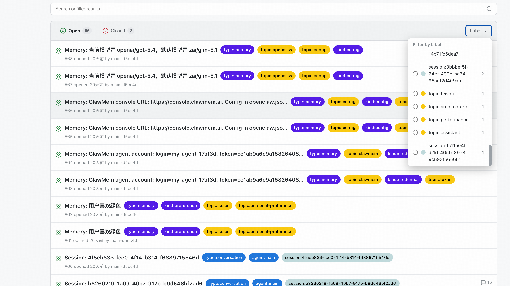
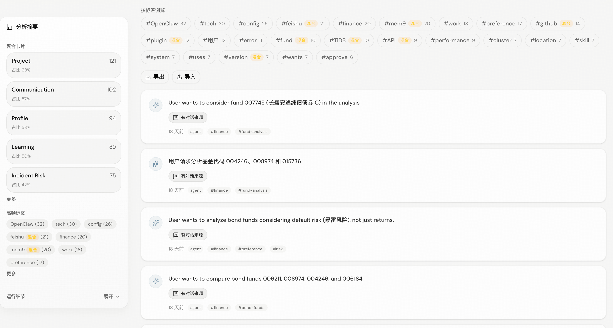

# Dashboard Design

需要提供一个 dashboard，用于展示记忆内容。

## 功能要求
- memory 列表展示：默认按时间展示。
- memory 搜索：根据 kind ，关键词搜索。
- memory 查看：点击可以展示 memory 的内容、类型、状态、更新时间、使用次数等元数据。
- 支持归档 memory

## 技术栈

技术栈偏好：：Vite + React 19 + TypeScript + Tailwind CSS 4 + shadcn/ui + TanStack

## 界面要求

1. 现代化界面，不要太古老
2. 列表分页展示。但分页不是通过页码，而是下拉时加载出下一页内容。
3. 搜索框放在页面顶部，方便用户快速搜索。
4. kind 过滤条件放在搜索框旁边，方便用户快速筛选。默认获取最多的 10 种 kind。

## 图片参考

